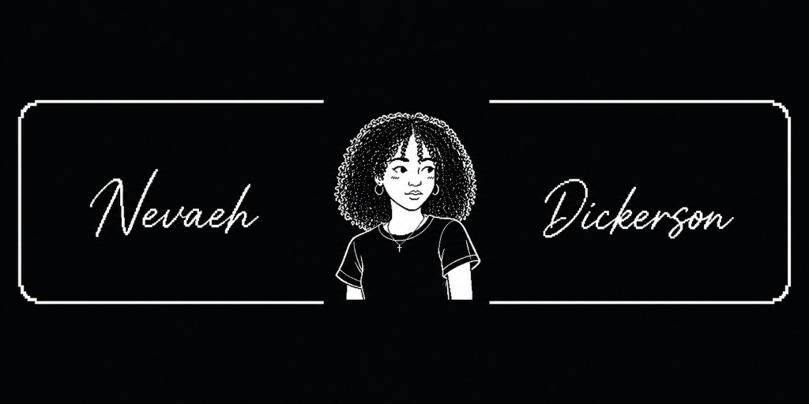

  

---

### Hi, I'm Nevaeh! *(nuh-vay-uh)*
🎓 Sophomore at **[Your University]**, studying Computer Science  
🔭 Aspiring **AI × Cybersecurity** builder — exploring how intelligent systems and cyber defense intersect
<!--I love tackling real-world problems at the edge of AI and security. I’m big on continuously learning and building my skills, and believe taking initiative is key to growth. *(Ask me about [your fellowship / club / program]!)* Currently, I'm focusing on **[what you're learning now — e.g. ML models, threat detection, secure systems]**. I’m looking to leverage and grow my skills in an internship where I can contribute to exciting projects and learn from industry professionals — got any leads? Let me know!
-->
---

### 🎯 Featured Project: **[Project Name]**

---

### 🛠 Tech Stack
- **Languages:** Python, Java, HTML, CSS, JavaScript *(add/remove as needed)*
- **AI / Data:** Pandas, NumPy, scikit-learn, TensorFlow *(edit to match you)*
<!--
- **Cyber / Security:** [e.g. Wireshark, Burp, Linux, networking basics]
-->
- **Web Dev:** HTML, CSS, JavaScript (basic), Node.js
- **Tools:** Jupyter, VS Code / Cursor
- **Databases:** SQL, MySQL

---

### 🚀 Projects
A few other noteworthy projects I’ve worked on:

---

### 📫 How to Reach Me
- **Email:** [youremail@domain.com](mailto:youremail@domain.com)
- **LinkedIn:** [linkedin.com/in/yourprofile](https://linkedin.com/in/yourprofile)
- **GitHub:** [Vaeh4Codes](https://github.com/Vaeh4Codes)

---

### 📊 GitHub Stats
<!-- Swap in your username if needed: https://github.com/anuraghazra/github-readme-stats -->

  
  

---

